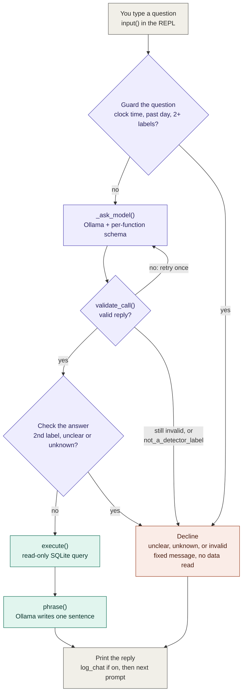

# Detection Assistant: Question to Reply

How `src/detection_assistant.py` turns a typed question into a printed reply.
The decisions behind each step are in ADRs
[0003](adr/0003-detection-assistant.md) (separate read-only process, the model
routes and phrases),
[0004](adr/0004-structured-model-output.md) (constrain, validate, retry),
[0005](adr/0005-routing-evaluation.md) (unclear intent, code guard),
[0006](adr/0006-label-vocabulary-in-schema.md) (label vocabulary in the
schema), and [0007](adr/0007-per-function-schema-and-label-check.md)
(per-function schema, second-label check).

## Reading the diagram

| Color | Meaning |
|---|---|
| Gray | Terminal input and output |
| Purple | Routing: the model is surrounded by code checks before and after |
| Teal | Data path: code answers the question, and the model only phrases the result |
| Coral | Decline: a fixed message; nothing is read and nothing is made up |

- **At most two model calls per question:** `_ask_model()` (twice if
  `validate_call()` forces a retry) and `phrase()`. A question the guard
  declines makes **no** model calls.
- **Where it happens in `route()`:** guard the question
  (`unsupported_features()`) → `_ask_model()` → guard the answer (a second
  label named in the question → `unclear`). `answer()` then declines
  `unclear`, `unknown`, and `invalid` with fixed messages.
- **Errors aren't on this path:** if Ollama is unreachable or `logs/events.db`
  is missing, the REPL loop prints a hint and returns to the prompt.

Keep this diagram in sync with `route()` and `answer()`: update it in the same
commit as any change to the flow.
